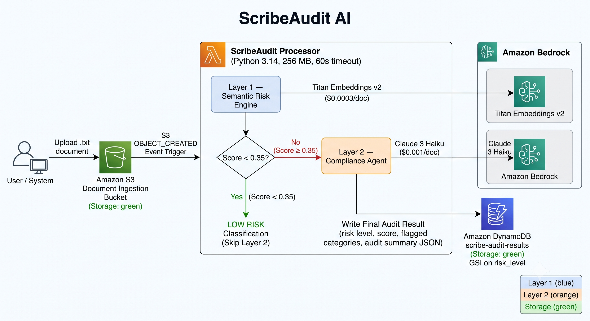

# ScribeAudit AI

A lightweight, serverless AI pipeline that ingests raw business transcripts, scores them for compliance risk using **Amazon Titan Embeddings v2** semantic similarity, and routes high-risk documents to an Amazon Bedrock LLM agent for structured audit reporting — all within the AWS free tier.

> **Why Titan Embeddings for Layer 1?** Rather than a classical rule-based NLP approach (keyword matching, regex patterns), Layer 1 uses vector embeddings to capture *semantic meaning*. The document is embedded into a high-dimensional vector and compared against pre-built reference vectors for each risk category using cosine similarity. This catches paraphrased and contextually equivalent risk language that exact-match patterns would miss — at a fraction of the cost of a full LLM call.

---

## Architecture



```text
  S3 Bucket (raw docs)
       │  OBJECT_CREATED
       ▼
  AWS Lambda (Python 3.14)
  ┌──────────────────────────────────────┐
  │  Layer 1: Semantic Risk Engine       │  ◄── ~$0.0003 / doc
  │  (Titan Embeddings cosine similarity)│
  │           │                          │
  │    score < 0.1 ?                    │
  │    ┌──────┴──────┐                   │
  │   YES            NO                  │
  │    │             │                   │
  │    ▼             ▼                   │
  │  LOW RISK    Layer 2: Bedrock        │  ◄── ~$0.001 / doc
  │              Claude 3 Haiku          │
  │              Compliance Agent        │
  └──────────────────────────────────────┘
       │
       ▼
  DynamoDB (structured audit results)    ◄── 25 GB free tier
```

### Two-Layer AI Strategy

| Layer | Technology | When | Cost |
|-------|-----------|------|------|
| 1 — Risk scoring | Amazon Titan Embeddings v2 (cosine similarity) | Every document | ~$0.0003/doc |
| 2 — Compliance agent | Amazon Bedrock (Claude 3 Haiku) | High-risk docs only | ~$0.001/doc |

**Layer 1** embeds the document using **Amazon Titan Embeddings v2** and computes cosine similarity against pre-built reference embeddings for five risk categories (financial fraud, securities violations, data privacy, operational risk, concealment indicators). Each category has a calibrated weight; the final score is a weighted sum of per-category similarity signals in `[0.0, 1.0]`. Documents scoring below the threshold (default `0.35`) are stored directly as `LOW` risk — no Claude call is made. Reference embeddings are built on the first invocation and cached for the container lifetime.

**Example Layer 1 output** — what Titan Embeddings actually returns and what `assess()` produces:

*Raw Titan embedding vector* (1,536 floats, truncated for display):

```json
{
  "embedding": [0.0142, -0.0381, 0.0724, 0.0056, -0.1203, 0.0891, ..., -0.0047]
}
```

*`assess()` return value for a high-risk document:*

```python
(
  0.712844,                                          # risk score in [0.0, 1.0]
  ["concealment_indicators", "financial_fraud"]      # flagged categories, sorted
)
```

*`assess()` return value for a low-risk document:*

```python
(
  0.031200,   # below 0.35 threshold → classified LOW, Layer 2 not called
  []
)
```

The raw embedding vector is never stored — only the final score and flagged categories are persisted to DynamoDB.

**Layer 2** fires a single structured prompt to Bedrock only when Layer 1 raises a flag. The model acts as a compliance auditor and returns a strict JSON report containing violations, regulatory frameworks, severity ratings, and recommended actions.

**Why not use Layer 2 alone?** Claude 3 Haiku costs ~$0.001 per document. At 1,000 documents/month that is ~$1 — small in isolation, but compliance pipelines in practice process tens of thousands of documents. More importantly, the vast majority of business documents are routine and low-risk. Sending every document to an LLM wastes money on documents that need no analysis. Layer 1 acts as a cheap pre-filter: at ~$0.0003/doc it screens out ~80% of documents as clearly low-risk, so Layer 2 only runs on the ~20% that warrant deeper inspection. The result is the same recall on true positives at roughly **5× lower cost** overall. This "cheap gate + expensive expert" pattern is standard in production ML pipelines.

**Is Layer 1 also an LLM?** No. Titan Embeddings is an **embedding model**, not a large language model. It does not generate text, reason, or answer questions. It only converts text into a fixed-size numeric vector (an "embedding") that encodes semantic meaning. Two pieces of text with similar meaning will produce vectors that point in similar directions — which is what cosine similarity measures. This is a much simpler and cheaper operation than running a generative LLM: there is no token-by-token generation, no attention over long contexts, and no instruction following. The tradeoff is that it can only tell you *how similar* a document is to a risk concept — not *why* it is risky or *what* action to take. That reasoning is left to Layer 2.

**What is cosine similarity?** It is a measure of how closely two vectors point in the same direction, regardless of their length. Given two vectors **A** and **B**:

$$\text{cosine\_similarity}(A, B) = \frac{A \cdot B}{\|A\| \cdot \|B\|}$$

The result is always between **−1** and **1**:

| Value | Meaning |
|---|---|
| `1.0` | Vectors point in exactly the same direction — texts are semantically identical |
| `0.7–0.9` | High similarity — texts discuss closely related concepts |
| `0.4–0.6` | Moderate similarity — some topical overlap |
| `< 0.4` | Low similarity — texts are about different topics |
| `−1.0` | Vectors point in opposite directions — semantically opposite |

In this project, each document is compared against five risk-category reference vectors. A similarity above `_SIMILARITY_BASELINE` (default `0.40`) means the document is semantically close enough to that risk category to contribute to the score. The closer the similarity is to `1.0`, the stronger the signal.

---

## Project Structure

```
scribe-audit-ai/
├── lambda/
│   ├── handler.py            # Lambda entry point + Bedrock agent
│   ├── risk_engine.py        # Layer 1 semantic risk scorer (Titan Embeddings)
│   └── requirements.txt      # Lambda deps (boto3 pre-installed in runtime)
│
├── infrastructure/
│   ├── app.py                # CDK app entry point
│   ├── cdk.json              # CDK configuration & feature flags
│   └── stacks/
│       └── scribe_audit_stack.py  # S3 + Lambda + DynamoDB + IAM
│
├── tests/
│   ├── conftest.py           # sys.path + mock AWS credentials
│   ├── test_risk_engine.py   # Unit tests for Layer 1 (no AWS)
│   └── test_handler.py       # Handler + Bedrock agent tests (mocked)
│
├── sample_docs/
│   ├── low_risk_sample.txt   # Clean earnings transcript
│   └── high_risk_sample.txt  # High-risk communication with violations
│
├── .github/workflows/
│   └── deploy.yml            # CI/CD: test → synth → deploy
│
├── requirements-dev.txt      # pytest, boto3, moto, aws-cdk-lib
└── README.md
```

---

## Prerequisites

| Tool | Version | Install |
|------|---------|---------|
| Python | ≥ 3.14 | [python.org](https://www.python.org/) |
| Node.js | ≥ 20 | [nodejs.org](https://nodejs.org/) |
| AWS CDK CLI | ≥ 2.x | `npm install -g aws-cdk` |
| AWS CLI | ≥ 2.x | [docs.aws.amazon.com](https://docs.aws.amazon.com/cli/latest/userguide/getting-started-install.html) |
| AWS Account | — | With Bedrock model access enabled |

### Enable Bedrock Model Access

In the AWS Console → **Amazon Bedrock** → **Model access** → request access for:

- `Anthropic Claude 3 Haiku`

---

## Local Setup & Testing

```bash
# Clone and enter the project
git clone https://github.com/<your-org>/scribe-audit-ai.git
cd scribe-audit-ai

# Create and activate a virtual environment
python -m venv .venv
# Windows:
.venv\Scripts\activate
# macOS/Linux:
source .venv/bin/activate

# Install development dependencies
pip install -r requirements-dev.txt

# Run the full test suite
pytest tests/ -v --cov=lambda --cov-report=term-missing
```

Expected output:

```
tests/test_risk_engine.py::TestEdgeCases::test_empty_string_returns_zero_without_calling_bedrock PASSED
tests/test_risk_engine.py::TestScoringMath::test_single_high_similarity_category_exceeds_threshold PASSED
...
---------- coverage: 23 passed in 0.36s ----------
```

### Test the risk engine directly (no AWS required)

You can invoke `RiskEngine` from a Python REPL without any AWS credentials:

```python
import sys
sys.path.insert(0, 'lambda')
from risk_engine import RiskEngine

engine = RiskEngine()  # connects to Bedrock; needs AWS credentials

with open('sample_docs/high_risk_sample.txt') as f:
    score, flagged_categories = engine.assess(f.read())
print(score, flagged_categories)  # e.g. 0.72, ['financial_fraud', 'concealment_indicators']

with open('sample_docs/low_risk_sample.txt') as f:
    score, flagged_categories = engine.assess(f.read())
print(score, flagged_categories)  # e.g. 0.08, []
```

> **Note:** This is a serverless application — there is no local server to start. All local development is done through the test suite and REPL, which mock AWS services via `moto`.

---

## Manual Deployment

### 1. Configure AWS credentials

```bash
aws configure
# AWS Access Key ID: <your key>
# AWS Secret Access Key: <your secret>
# Default region: us-east-1
```

### 2. Bootstrap CDK (one-time per account/region)

```bash
cd infrastructure
cdk bootstrap aws://<ACCOUNT_ID>/us-east-1
```

### 3. Deploy the stack

```bash
cdk deploy
```

CDK outputs the resource names on completion:

```
Outputs:
ScribeAuditStack.IngestionBucketName = scribe-audit-ingestion-<account-id>
ScribeAuditStack.AuditTableName      = scribe-audit-results
ScribeAuditStack.LambdaFunctionName  = scribe-audit-processor
```

### 4. Test the pipeline end-to-end

```bash
# Upload a sample document to trigger the pipeline
aws s3 cp sample_docs/high_risk_sample.txt \
  s3://scribe-audit-ingestion-<account-id>/high_risk_sample.txt

# Check DynamoDB for the audit result
aws dynamodb scan --table-name scribe-audit-results \
  --filter-expression "risk_level = :lvl" \
  --expression-attribute-values '{":lvl":{"S":"HIGH"}}'
```

---

## CI/CD Setup (GitHub Actions)

Add the following secrets to your GitHub repository (**Settings → Secrets and variables → Actions**):

| Secret | Description |
|--------|-------------|
| `AWS_ACCESS_KEY_ID` | IAM user key (deploy permissions) |
| `AWS_SECRET_ACCESS_KEY` | IAM user secret |
| `AWS_ACCOUNT_ID` | 12-digit AWS account ID |
| `AWS_REGION` | Target region (e.g. `us-east-1`) |

The pipeline runs three jobs:

1. **Test** — `pytest` on every push and PR
2. **CDK Synth** — validates the CloudFormation template (requires AWS credentials)
3. **CDK Deploy** — deploys to AWS on every merge to `main`

---

## Configuration

All runtime behaviour is controlled via Lambda environment variables (set in the CDK stack):

| Variable | Default | Description |
|----------|---------|-------------|
| `DYNAMODB_TABLE` | `scribe-audit-results` | DynamoDB table name |
| `RISK_THRESHOLD` | `0.35` | Score above which Layer 2 is triggered |
| `BEDROCK_MODEL_ID` | `anthropic.claude-3-haiku-20240307-v1:0` | Bedrock model |
| `MAX_BEDROCK_CHARS` | `4000` | Max characters sent to Claude per document |
| `EMBEDDING_MODEL_ID` | `amazon.titan-embed-text-v2:0` | Titan model used for Layer 1 scoring |

To tune the risk threshold, edit `RISK_THRESHOLD` in `infrastructure/stacks/scribe_audit_stack.py` and redeploy.

---

## DynamoDB Schema

Each processed document produces one item:

| Attribute | Type | Example |
|-----------|------|---------|
| `document_id` | String (PK) | `"a3f2c1d0-..."` |
| `timestamp` | String (SK) | `"2026-06-07T14:23:01+00:00"` |
| `s3_bucket` | String | `"scribe-audit-ingestion-123456789"` |
| `s3_key` | String | `"reports/q3-advisory.txt"` |
| `risk_level` | String | `"HIGH"` or `"LOW"` |
| `risk_score` | Decimal | `0.7125` |
| `flagged_categories` | List | `["financial_fraud", "concealment_indicators"]` |
| `audit_summary` | String (JSON) | Bedrock compliance report or low-risk stub |

A **GSI** (`RiskLevelIndex`) allows efficient queries by `risk_level`.

---

## Estimated Cost

| Service | Usage | Monthly cost |
|---------|-------|-------------|
| Lambda | 1,000 invocations, 256 MB, 10s avg | < $0.01 |
| S3 | 1,000 PUTs + 5 GB storage | < $0.15 |
| DynamoDB | PAY_PER_REQUEST, < 25 GB | $0.00 (free tier) |
| Bedrock (Titan Embeddings) | 1,000 docs × ~500 tokens | ~$0.30 |
| Bedrock (Haiku) | 200 high-risk docs × ~2k tokens | ~$0.05 |
| **Total** | | **≈ $0.51 / month** |

---

## Teardown

```bash
cd infrastructure
cdk destroy
```

> The DynamoDB table uses `RemovalPolicy.RETAIN` to protect audit data. Delete it manually if required.

---

## License

MIT
